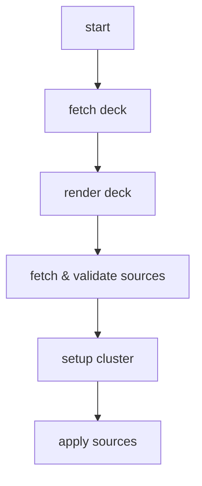

# Design

This file is intended to start collecting/discussing architectural & feature design questions.
Future refactoring, tests and features will be based on this document.

## Command: deck get

Current Problems:

- temporary folders and files are not persisted long enough

Feature Ideas:

- cache
- override
- templating
  - env
  - secrets
